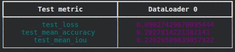
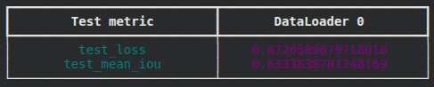

# Infrastructure Segmentation with SegFormer

---

## Project Overview

This project performs **semantic segmentation of Infrastructures** using **SegFormer**, a transformer-based segmentation model. We fine-tune a pretrained SegFormer model 
**[ nvidia segformer-b5-finetuned-cityscapes-1024-1024 ]** for our custom dataset to identify features such as bridges, buildings, roads, and dams.  

Key highlights:
- Pretrained on **Cityscapes** dataset.
- Fine-tuned on a custom Infrastructure dataset.
- Explored different loss functions for improved segmentation performance.

---

## Dataset

Our dataset contains images of Infrastructures annotated with the following classes:

- Bridge, Building, Cottage, Dam, Haystack, House, Irrigation Channel, Road, Temple, Wall, Log

Dataset splits:
- **Training:** Images + segmentation masks
- **Validation:** Images + masks
- **Test:** Images + masks

*The dataset was managed and downloaded via Roboflow:*

## Performance Comparison: Cross-Entropy vs Cross-Entropy + Dice Loss

We evaluated the model using two different loss functions:

1. **Cross-Entropy Loss (baseline)**
2. **CrossEntropyLoss + Dice Loss (improved approach)**

### Test Metrics Before Loss Change (Cross-Entropy Only)

### Test Metrics After Loss Change (CrossEntropy + Dice Loss)

---

## Interpretation

### Why did Test Loss increase?

Although the test loss increased from **0.09 → 0.87**, The reason is that **Dice Loss has a different numerical scale** compared to Cross-Entropy:

- Dice Loss measures *region-level overlap*, not pixel-wise classification.
- Combined loss values are typically higher.

---

### Why did IoU improve so much?

IoU improved significantly from **0.22 → 0.63**, It usually means the predicted regions are closer to the ground truth in both size and location.

- Dice Loss directly optimizes region overlap (similar to IoU).
- It helps the model learn small objects and thin structures.
- It is robust to class imbalance.
- It encourages better segmentation on minority classes.

Thus, the new loss improved the **segmentation quality**.

---

### Why is Accuracy still low?

Even after improvement in IoU, pixel-level accuracy tends to stay low because:

- The dataset is **highly imbalanced**.
- Accuracy does not reflect how well the model captures *shapes* — it only counts pixel matches.
- Small objects (bridge, log, irrigation channel) contribute very few pixels.
- Missing those small objects barely changes accuracy but hurts IoU a lot.

In segmentation tasks with unbalanced classes, **IoU is a much better metric** than accuracy.

---

## Summary of Findings

- Cross-Entropy alone gave low IoU because it focuses on pixel-wise classification, not region overlap.
- Adding Dice Loss improved IoU dramatically, meaning better segmentation and shape recognition.
- The increase in loss is expected due to the new loss formulation.
- Accuracy remains low because the dataset is imbalanced and accuracy is sensitive to background dominance.
- **Conclusion:** CrossEntropy + Dice Loss is significantly better for this segmentation task, especially for small and complex structures.

## Model Link

1. Model with Cross-Entropy Loss = https://drive.google.com/drive/folders/11xsfwBkJpJd13RW4s1-HawEgdbEJHQoC?usp=sharing 
2. Model with CrossEntropyLoss + Dice Loss = https://drive.google.com/drive/folders/1UqkVTDdTMvgun3_JKoCstaIU5fyVPIZ-?usp=sharing